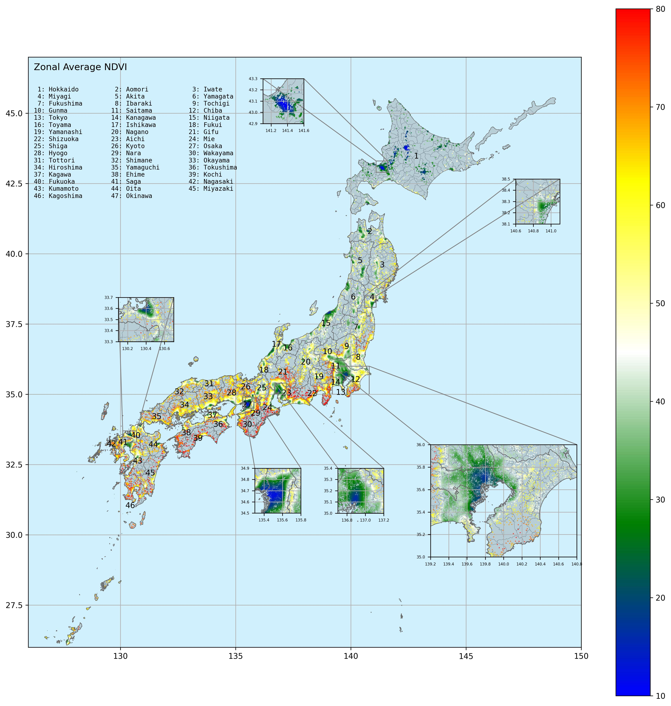
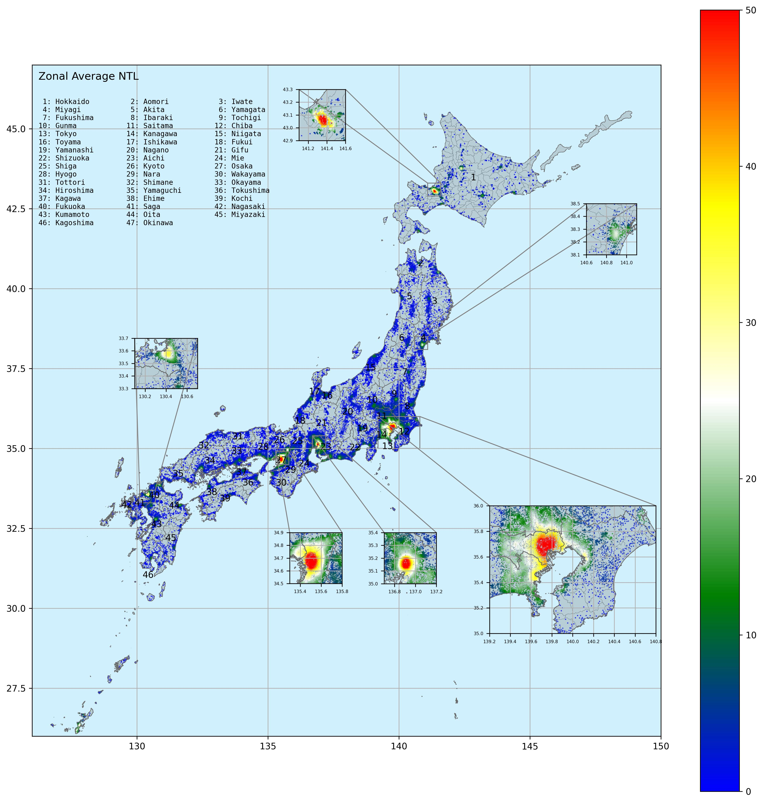

# A Spatial Machine Learning Approach to Valuing Development and Greenness in Well-Being (DP15)    
  
The positive impact of greenness, represented by normalized difference vegetation index (NDVI), in residential environments on human well-being has been documented and recognized. As a widely used proxy, the nighttime light (NTL) indicates the regional socio-economic status and development level. Higher development levels and economic status, coming with high-level NTL, are related to more opportunities and higher income, but also associated with crowded environments and light pollution. However, the relationships between human well-being and greenness and development level remain inconclusive. Here, we demonstrate the complex nexuses between subjective well-being (SWB) and NDVI and NTL by employing the random forest method. We have optimized the partial dependence analysis and created a novel approach to estimate the local marginal effects of NDVI, NTL, and income. Overall, NDVI is positively associated with SWB, while NTL is negatively linked. Those relationships spatially vary. On average, a one-percentage-point absolute increase in local environment NDVI is associated with a 379.01 USD increase in annual income, while a 1-nW/(cm²·sr) increase in local NTL is equivalent to a 1434.59 USD decline in annual income. These values represent average marginal trade-offs derived from locally non-linear relationships. According to our results, greenness and development improvement should consider the local environments rather than simply formulating one-size-fits-all policies or strategies. To conclude,  retaining a moderate development intensity and greening based on the local status are necessary ways to achieve a sustainable society and improve human well-being.   

## Author  
Chao Li, Shunsuke Managi  
    
## Result: Monetary Values of NDVI    
  
   
## Result: Monetary Values of NTL    

  
## Maunscript  
[**A Spatial Machine Learning Approach to Valuing Development and Greenness in Well-Being**](05_Manuscript/DP15.pdf)      

## Py Code
**12_PyCode**    
   
## Contact Us:
- Email: Prof. Shunsuke Managi <managi@doc.kyushu-u.ac.jp>  
- Email: Chao Li <chaoli0394@gmail.com>
  
## Term of Use:
Authors/funders retain copyright (where applicable) of code on this Github repo. This GitHub repo and its contents herein, including data, link to data source, and analysis code that are intended solely for reproducing the results in the manuscript **"A Spatial Machine Learning Approach to Valuing Development and Greenness in Well-Being"**. The analyses rely upon publicly available data from multiple sources, that are often updated without advance notice. We hereby disclaim any and all representations and warranties with respect to the site, including accuracy, fitness for use, and merchantability. By using this site, its content, information, and software you agree to assume all risks associated with your use or transfer of information and/or software. You agree to hold the authors harmless from any claims relating to the use of this site.  