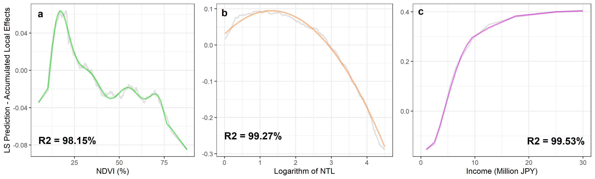

# Greenness and Nighttime Light Positively Affect Human Well-being within Certain Ranges  
# -	An Empirical Machine Learning Analysis (DP15)    
  
The positive effects of greenness in living environments on human well-being are known. As a widely used proxy, the nighttime light (NTL) indicates the regional socio-economic status and development level. Higher development levels and economic status are related to more opportunity and higher income, ultimately leading to greater human well-being. However, whether simple increases in greenness and NTL always produce positive results remains inconclusive. Here, we demonstrate the complex relationships between human well-being and greenness and NTL by employing the random forest method. The accuracy of this model is 81.83%, exceeding most previous studies. According to the analysis results, the recommended ranges of greenness and NTL in living environments are 10.91% - 32.99% and 0 – 17.92 nW⁄(cm2\*sr), respectively. Moreover, the current average monetary values of greenness and NTL are 3351.96 USD⁄% and 658.11 USD⁄nW⁄(cm2\*sr), respectively. The residential areas are far away from the abundant natural resources, which makes the main population desire more greenness in their living environments. Furthermore, high urban development density, represented by NTL, has caused adverse effects on human well-being in metropolitan areas. Therefore,  retaining a moderate development intensity is an effective way to achieve a sustainable society and improve human well-being.   

## Author  
Chao Li, Shunsuke Managi  

## Result: PALEF of NDVI, NTL, and income  
  
    
## Result: Monetary Values of NDVI  
  
   
## Result: Monetary Values of NTL  

  
## Maunscript  
[**Greenness and Nighttime Light Positively Affect Human Well-being within Certain Ranges**](05_Manuscript/Manuscript.pdf)  
  
## R Code  
**[01_DW_DataWellBeingGreennessNTL_v1.R](02_RCode/01_DW_DataWellBeingGreennessNTL_v1.R)**: 
This script creates the basic data set, with 24 features and 478,266 obvs.   
**[03_AN_LsNdviNtlRf_v1.R](02_RCode/03_AN_LsNdviNtlRf_v1.R)**: .   
**[04_AN_AleplotNdviNtlRf_v1.R](02_RCode/04_AN_AleplotNdviNtlRf_v1.R)**:  .   
**[05_VI_AleplotNdviNtlRf_v1.R](02_RCode/05_VI_AleplotNdviNtlRf_v1.R)**: .    
**[06_AN_AleMsrGrid_v1.R](02_RCode/06_AN_AleMsrGrid_v1.R)**: .      
**[SP_03_AN_LsNdviNtlRf_v1.R](02_RCode/SP_03_AN_LsNdviNtlRf_v1.R)**: .     
**[SP_04_AN_AleplotNdviNtlRf_v1.R](02_RCode/SP_04_AN_AleplotNdviNtlRf_v1.R)**: .   
**NOTE:** This repo DOES NOT include the survey, due to the rights and responsibility of 
the this Github Owner.
   
## Workflow
**WF.A: 01 -> 03 -> 04 -> 05 -> 06 -> 08 -> END**   
**WF.A.01.03**: This step get the random forest model.  
**WF.A.03.04**: This step get ALEs, PALEFs, monetary values of features of interest.  
**WF.A.04.05**: Visualization of ALEs, PALEFs, and monetary values.  
**WF.A.05.06**: Get gridded average value of monetary values.  
**WF.A.06.08**: Visualization of average value of monetary values.  
   
## Contact Us:
- Email: Prof. Shunsuke Managi <managi@doc.kyushu-u.ac.jp>  
- Email: Chao Li <chaoli0394@gmail.com>
  
## Term of Use:
Authors/funders retain copyright (where applicable) of code on this Github repo. This GitHub repo and its contents herein, including data, link to data source, and analysis code that are intended solely for reproducing the results in the manuscript "Greenness and Nighttime Light Positively Affect Human Well-being within Certain Ranges". The analyses rely upon publicly available data from multiple sources, that are often updated without advance notice. We hereby disclaim any and all representations and warranties with respect to the site, including accuracy, fitness for use, and merchantability. By using this site, its content, information, and software you agree to assume all risks associated with your use or transfer of information and/or software. You agree to hold the authors harmless from any claims relating to the use of this site.  