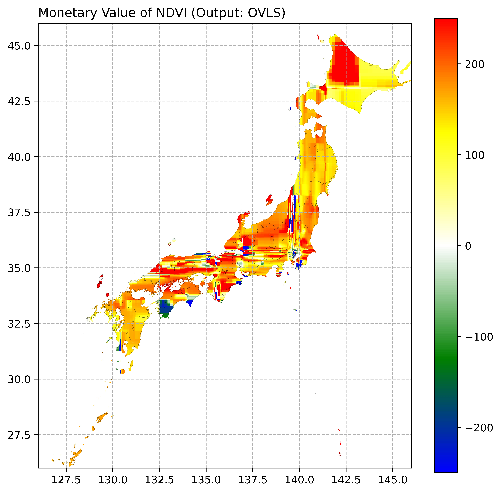
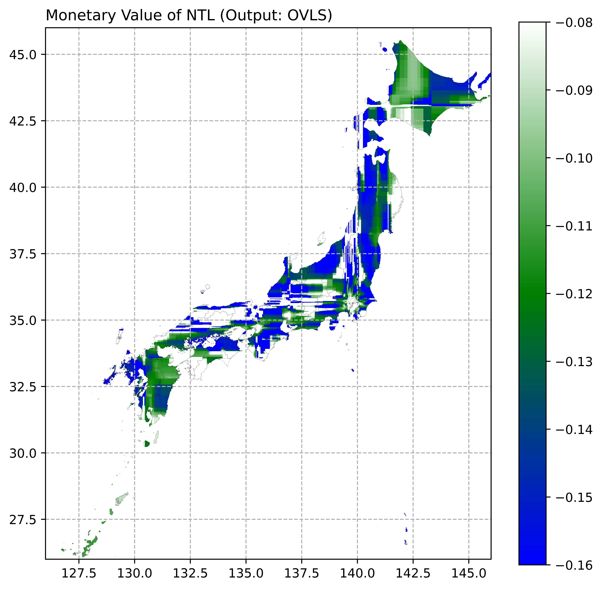

# Greenness, Nighttime Light, and Human Well-being
# -	Complex Nexuses Probed by Machines (DP15)    
  
The positive effects of greenness in living environments on human well-being are known. As a widely used proxy, the nighttime light (NTL) indicates the regional socio-economic status and development level. Higher development levels and economic status are related to more opportunity and higher income, but NTL also causes light pollution and other negative factors. However, the relationships between human well-being and greenness and NTL remains inconclusive. Here, we demonstrate the complex nexuses between subjective well-being (SWB) and greenness and NTL by employing the random forest method. We apply the Shapley additive explanations (SHAP) to estimate the contributions of greenness, NTL, and other features to SWB. Because SHAP is a completely local way and cannot provide a general explanation, building connections between feature values and their contributions is critical. We create a novel approach to connect them on a geographical ground. Although overall greenness is positively associated with SWB, while NTL is negatively linked, the relationships spatially vary. For example, on average, the monetary value of a 1% increase in greenness on overall life satisfaction (OVLS, an SWB indicator) is 120.94 (95%CI: 120.11 - 121.77) USD, while the monetary value of NTL on OVLS is  -833.96 (-956.85 - -711.08) USD/(nW⁄($cm^2$∙sr)). According to our results, greenness and NTL improvement should consider the local environments rather than simply formulating one-size-fits-all policies or strategies. To conclude,  retaining a moderate development intensity and greening based on the local status are necessary ways to achieve a sustainable society and improve human well-being.   

## Author  
Chao Li, Shunsuke Managi  
    
## Result: Monetary Values of NDVI (OVLS)    
  
   
## Result: Monetary Values of NTL (OVLS)    

  
## Maunscript  
[**Greenness and Nighttime Light Positively Affect Human Well-being within Certain Ranges**](05_Manuscript/Manuscript.pdf)  
  
## R Code  
**[01_DW_DataWellBeingGreennessNTL_v1.R](02_RCode/01_DW_DataWellBeingGreennessNTL_v1.R)**: 
This script creates the basic data set, with 29 features and 478,266 obvs.   
**NOTE:** This repo DOES NOT include the survey data, due to the rights and responsibility of 
the this Github Owner.      

## Py Code
**[06_PyCode/01_AN_HyperparameterTuning_v0.py](06_PyCode/01_AN_HyperparameterTuning_v0.py)**: 
This script is to select "max_feature" locally for all four SWB indicator.     
 
   
## Workflow
**WF.A: 01 -> 03 -> 04 -> 05 -> 06 -> 08 -> END**   
**WF.A.01.03**: This step get the random forest model.  
**WF.A.03.04**: This step get ALEs, PALEFs, monetary values of features of interest.  
**WF.A.04.05**: Visualization of ALEs, PALEFs, and monetary values.  
**WF.A.05.06**: Get gridded average value of monetary values.  
**WF.A.06.08**: Visualization of average value of monetary values.  
   
## Contact Us:
- Email: Prof. Shunsuke Managi <managi@doc.kyushu-u.ac.jp>  
- Email: Chao Li <chaoli0394@gmail.com>
  
## Term of Use:
Authors/funders retain copyright (where applicable) of code on this Github repo. This GitHub repo and its contents herein, including data, link to data source, and analysis code that are intended solely for reproducing the results in the manuscript **"Greenness and Nighttime Light Positively Affect Human Well-being"**. The analyses rely upon publicly available data from multiple sources, that are often updated without advance notice. We hereby disclaim any and all representations and warranties with respect to the site, including accuracy, fitness for use, and merchantability. By using this site, its content, information, and software you agree to assume all risks associated with your use or transfer of information and/or software. You agree to hold the authors harmless from any claims relating to the use of this site.  